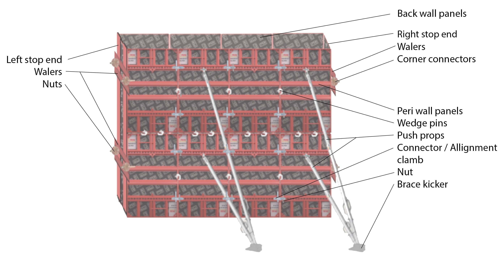

### Procedure

#### Step 1: Marking the Area for the Wall: Begin by accurately marking the wall's dimensions on the construction site. This involves using laser levels and measuring tapes to ensure precision. Proper marking is essential for ensuring that the formwork is placed correctly. 

#### Step 2: Assembling PERI Wall Panels: Transport the required PERI panels to the site and begin assembling them. Ensure that the panels are clean and free from any debris that could affect the concrete's finish. Start from one corner and work your way around the marked area. 

#### Step 3: Connecting Panels with wedge pins: wedge pins are used to attach panels together. 

#### Step 4: Attaching Push Props: Once the panels are in place, attach push props to keep the formwork straight. Adjust the props as necessary to ensure that the panels are vertically aligned. This step is crucial for achieving a straight wall. Brace kicker is used for strong grip in ground. 

#### Step 5: Securing with PERI connectors, nuts: Use PERI connectors / alignment clamp to secure adjacent panels, ensuring that there are no gaps or misalignments. Double-check that all connectors are tightened securely to prevent movement during concrete pouring. 

#### Step 6: Back side wall: Repeat the step 2-5 to fix the back side of the wall 

#### Step 7: Left stop end: Attach the left stop end of the wall, support the stop end part with walers & secure the connection with Corner connectors. 

#### Step 8: Right stop end: Repeat the step 7 to fix the right stop end. 

#### Step 9: Final Checks: Before pouring concrete, conduct a thorough inspection of the entire formwork structure. Check that all components are properly connected and that the formwork is stable and plumb. Any loose or misaligned components should be corrected before proceeding. 

#### Step 10: Concrete Pouring and Curing: Once the formwork is confirmed to be secure, proceed with the concrete pouring. Ensure that the concrete is poured evenly and that the formwork can withstand the pressure. After pouring, allow the concrete to cure properly before removing the formwork. 

  

#### Considerations: 

Safety and quality control are paramount in formwork construction. The formwork must be capable of supporting the weight of the concrete, workers, and equipment without deforming or collapsing. Additionally, environmental factors such as wind, temperature, and humidity should be considered, as they can affect the concrete's curing process and the formwork's stability.  
Regular inspections and maintenance of the formwork components are essential to ensure their longevity and effectiveness. Reusable components should be cleaned and stored properly after each use to extend their lifespan. Proper training and coordination among the construction team are also critical to avoid mistakes and ensure the project is completed safely and efficiently.

