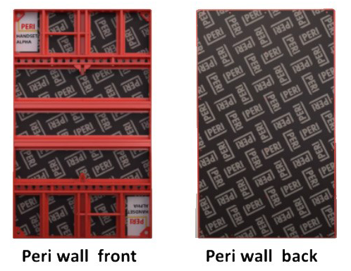
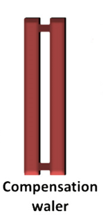
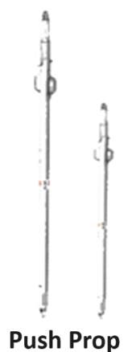
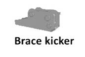
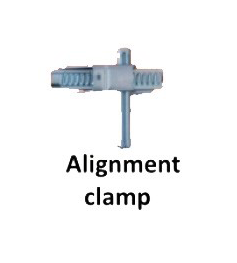
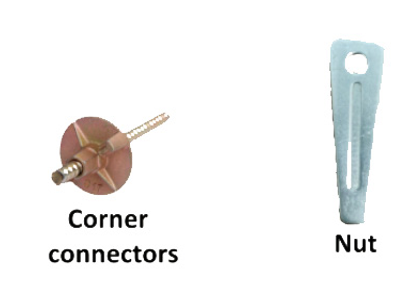

### Theory

PERI Formwork is a modular formwork system designed for flexibility, durability, and efficiency. It allows for the construction of various wall types, including straight, curved, and complex geometric shapes. The system's prefabricated components ensure precision, while its ease of assembly reduces labour time and costs. PERI Formwork is particularly valued for its ability to handle high pressures from fresh concrete, making it a reliable choice for large-scale wall construction projects. 

#### Components of Wall Formwork: 

1. <b>PERI Panels:</b> These are the primary forming surfaces where concrete is poured. Made from high-quality steel or aluminium, they provide a smooth finish and can withstand repeated use. Their modular nature allows for quick assembly and disassembly.

   

2. <b>Walers:</b> These provides lateral support to the panels

   

3. <b>Push-Pull Props:</b> These adjustable props are used to keep the formwork panels plumb (vertically aligned) during and after the pouring process. They are crucial for ensuring that the wall remains straight and true.

   

4. <b>Brace kicker:</b> These are attached in the ground, used to provide a strong grip to the props

   

5. <b>Alignment Clamps:</b> Specialized clamps designed to connect adjacent PERI panels. These clamps ensure a tight connection, reducing the risk of leakage and misalignment. They are designed to be easily adjustable, allowing for quick setup and changes on site.

   

6. <b>Corner Panels:</b> These panels are specifically designed to form the corners of walls (left & right stop end). They maintain the correct angles and provide additional structural support to the formwork, ensuring that the corners are as strong as the rest of the wall.

7. <b>Corner connector:</b> These are provided to ensure strong connection in the corner, connecting side stops to back or front panels.

   

8. <b>Tie Rods:</b> Tie rods are essential for maintaining the spacing between the PERI panels. They help resist the lateral pressure exerted by the fresh concrete, ensuring that the wall thickness is uniform throughout.

